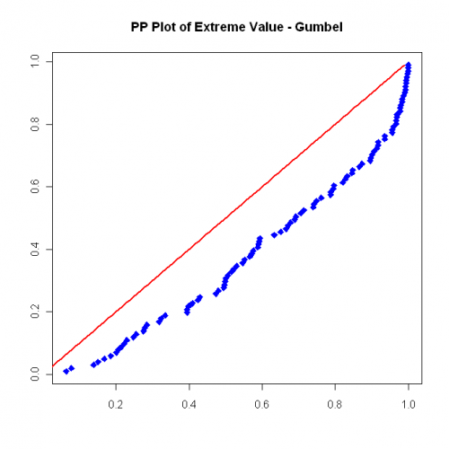
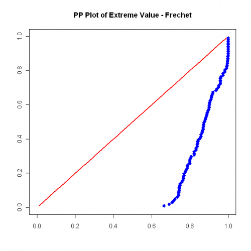
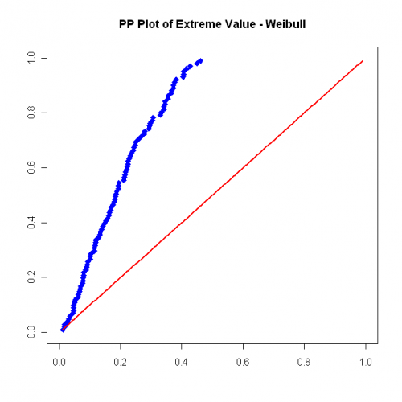
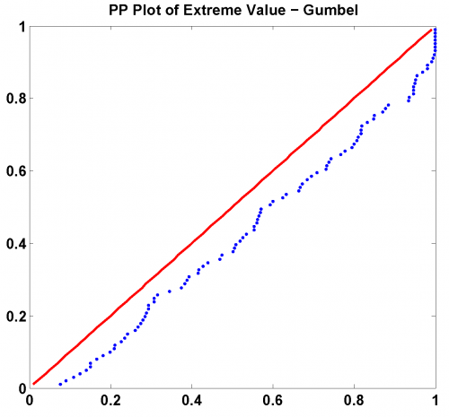
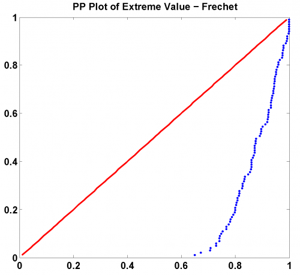
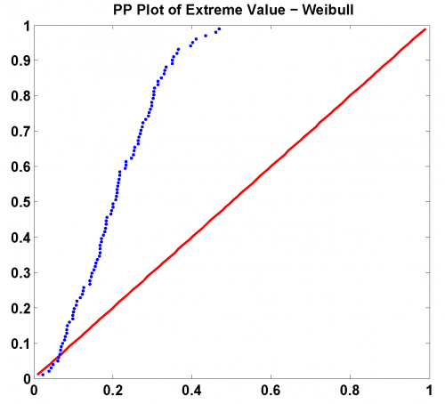

[](http://quantlet.de/)

## [](http://quantlet.de/) **SFSevt2** [](http://quantlet.de/)

```yaml

Name of QuantLet: SFSevt2

Published in: 'Statistics of Financial Markets : Exercises and Solutions'

Description: 'Generates CDFs for normal distribution of a pseudo random variable with extreme value (Gumbel, Frechet and Weibull) and a randomnormal distributed variable.'

Keywords: 'Frechet, Weibull, cdf, distribution, extreme-value, gumbel, normal, pp-plot, random'

See also: 'SFS_mef_frechet, SFEevt1, SFEevt2, SFSheavytail, SFSmeanExcessFun, SFSmeffrechet, SFSmsr1, SFSportfolio, SFSportfolio, SFSportfolio, SFStailGEV, SFStailGEV, SFStailGPareto, SFStailGPareto, SFStailport, SFSvar_block_max_backtesting, SFSvar_block_max_params, SFSvar_pot_backtesting, SFSvar_pot_params'

Author: Lasse Groth

Submitted: Mon, December 12 2016 by Monique Reiske

Author[MatLab]: Juergen Franke

Example: The plots show the distribution for 1. Gumbel, 2. Frechet and 3. Weibull.


```













### R Code
```r

# ------------------------------------------------------------------------------ Book: SFS
# ------------------------------------------------------------------------------ Quantlet: SFSevt2
# ------------------------------------------------------------------------------ Description: SFSevt2 generates CDFs for
# normal distribution of a pseudo random variable with extreme value (Gumbel, Frechet and Weibull) and a random normal
# distributed variable.  ------------------------------------------------------------------------------ Usage: -
# ------------------------------------------------------------------------------ Inputs: None
# ------------------------------------------------------------------------------ Output: PP plots
# ------------------------------------------------------------------------------ Example: PP plot - 1. Gumbel PP plot - 2.
# Frechet PP plot - 3. Weibull ------------------------------------------------------------------------------ Author: Lasse
# Groth 20091013 ------------------------------------------------------------------------------

# Load library
install.packages("QRM")
library(QRM)

# Close all plots and clear variables
graphics.off()
rm(list = ls(all = TRUE))

n = 100

# Gumbel
gumb1 = rGEV(100, xi = 0, mu = 0, sigma = 1)
gumb2 = sort(gumb1)
gumb = pnorm(gumb2, 0, 1)

t = (1:n)/(n + 1)

dev.new()
plot(gumb, t, col = "blue", pch = 23, bg = "blue", xlab = c(""), ylab = c(""))
lines(t, t, type = "l", col = "red", lwd = 2)
title("PP Plot of Extreme Value - Gumbel")

# Frechet
frec1 = rGEV(100, xi = 0.5, sigma = 0.5, mu = 1)
frec2 = sort(frec1)
frec = pnorm(frec2, 0, 1)

t = (1:n)/(n + 1)

dev.new()
plot(frec, t, col = "blue", pch = 23, bg = "blue", xlab = c(""), ylab = c(""), xlim = c(0, 1), ylim = c(0, 1))
lines(t, t, type = "l", col = "red", lwd = 2)
title("PP Plot of Extreme Value - Frechet")

# Weibull
weib1 = rGEV(100, xi = -0.5, sigma = 0.5, mu = -1)
weib2 = sort(weib1)
weib = pnorm(weib2, 0, 1)

t = (1:n)/(n + 1)

dev.new()
plot(weib, t, col = "blue", pch = 23, bg = "blue", xlab = c(""), ylab = c(""), xlim = c(0, 1), ylim = c(0, 1))
lines(t, t, type = "l", col = "red", lwd = 2)
title("PP Plot of Extreme Value - Weibull") 

```

automatically created on 2018-05-28

### MATLAB Code
```matlab

% ---------------------------------------------------------------------
% Book:         SFS
% ---------------------------------------------------------------------
% Quantlet:     SFSevt2
% ---------------------------------------------------------------------
% Description:  SFSevt2 generates CDFs for normal distribution of a 
%               pseudo random variable with extreme value (Gumbel, 
%               Frechet and Weibull) and a randomnormal distributed 
%               variable.   
% ---------------------------------------------------------------------
% Usage:        -
% ---------------------------------------------------------------------
% Inputs:       None
% ---------------------------------------------------------------------
% Output:       PP plot.
% ---------------------------------------------------------------------
% Example:      PP plot - 1. Gumbel
%               PP plot - 2. Frechet
%               PP plot - 3. Weibull
% ---------------------------------------------------------------------
% Author:       Juergen Franke 20030501
% ---------------------------------------------------------------------

clear
clc
close all

n = 100;

% Gumbel
gumb1 = gevrnd(0,1,0,100,1);
gumb2 = sort(gumb1);
gumb  = normcdf(gumb2,0,1);

t = (1:n)/(n+1);

hold on
figure(1)
plot(t,t,'r','LineWidth',2)
scatter(gumb,t,'.','b')
hold off
title('PP Plot of Extreme Value - Gumbel')

% Frechet
frec1 = gevrnd(0.5,0.5,1,100,1);
frec2 = sort(frec1);
frec  = normcdf(frec2,0,1);

t = (1:n)/(n+1);

figure(2)
hold on
plot(t,t,'r','LineWidth',2)
scatter(frec,t,'.','b')
hold off
xlim([0 1])
ylim([0 1])
title('PP Plot of Extreme Value - Frechet')

% Weibull
weib1 = gevrnd(-0.5,0.5,-1,100,1);
weib2 = sort(weib1);
weib  = normcdf(weib2,0,1);

t = (1:n)/(n+1);

figure(3)
hold on
plot(t,t,'r','LineWidth',2)
scatter(weib,t,'.','b')
hold off
xlim([0 1])
ylim([0 1])
title('PP Plot of Extreme Value - Weibull')
```

automatically created on 2018-05-28