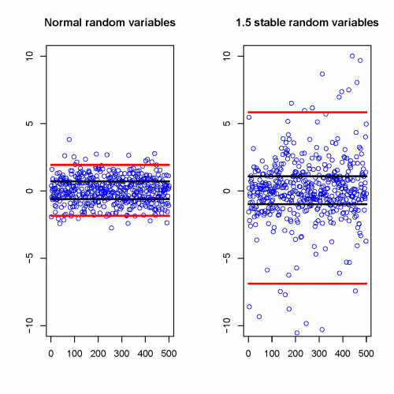
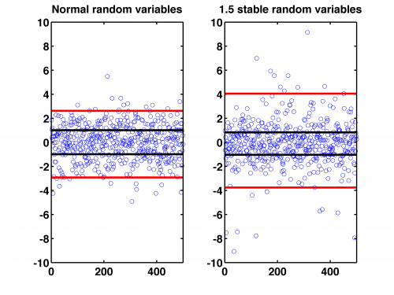

[](http://quantlet.de/)

## [](http://quantlet.de/) **SFSheavytail** [](http://quantlet.de/)

```yaml

Name of QuantLet: SFSheavytail

Published in: 'Statistics of Financial Markets : Exercises and Solutions'

Description: 'Simulation of 500 random normal (left) and 1.5-stable (right) normal variables with 25% and 75% quantiles (black lines and 2.5% and 97.5% quantiles (red lines) of the distributions. Refers to exercise 16.1 in SFS. SFSheavytail depends on the function stabrnd for MatLab.'

Keywords: distribution, normal, quantile, random, stable

See also: 'SFSevt2, SFSmeanExcessFun, SFSmsr1, SFSportfolio, SFStailGEV, SFStailGEV, SFStailGPareto, SFStailport, SFSvar_block_max_backtesting, SFSvar_block_max_params, SFSvar_pot_backtesting, SFSvar_pot_params, stabrnd'

Author: Lasse Groth

Submitted: Mon, December 12 2016 by Monique Reiske

Example: 'The plots show the simulation of 500 1.5-stable and normal variables with different quantiles.'


```





### R Code
```r

# ------------------------------------------------------------------------------ Book: SFS
# ------------------------------------------------------------------------------ Quantlet: SFSheavytail
# ------------------------------------------------------------------------------ Description: Simulation of 500 random
# normal (left) and 1.5-stable (right) normal variables with 25% and 75% quantiles (black lines and 2.5% and 97.5% quantiles
# (red lines) of the distributions.  Refers to exercise 16.1 in SFS.
# ------------------------------------------------------------------------------ Usage: -
# ------------------------------------------------------------------------------ Inputs: None
# ------------------------------------------------------------------------------ Output: Plot of the simulated normal random
# variables with different quantiles.  ------------------------------------------------------------------------------
# Example: - ------------------------------------------------------------------------------ Author: Lasse Groth 20091112
# ------------------------------------------------------------------------------

# Load library
install.packages("QRM")
library(QRM)

# Close all plots and clear variables
graphics.off()
rm(list = ls(all = TRUE))

n = 500

# Simulate random normal variables and stable normal variable.
nor = rnorm(n, 0, 1)
sta = rstable(n, 1.5, 0)

# Determine the quantiles
sumnor = quantile(nor, c(0.025, 0.25, 0.5, 0.75, 0.975))
noru = sumnor[2] * matrix(1, n, 1)
norl = sumnor[4] * matrix(1, n, 1)
noruu = sumnor[1] * matrix(1, n, 1)
norll = sumnor[5] * matrix(1, n, 1)

sumsta = quantile(sta, c(0.025, 0.25, 0.5, 0.75, 0.975))
stau = sumsta[2] * matrix(1, n, 1)
stal = sumsta[4] * matrix(1, n, 1)
stauu = sumsta[1] * matrix(1, n, 1)
stall = sumsta[5] * matrix(1, n, 1)

# Plot the random variables
par(mfrow = c(1, 2))
plot(nor, col = "Blue", xlim = c(0, n), ylim = c(-10, 10), xlab = "", ylab = "")
title("Normal random variables")

lines(noru, col = "black", lwd = 3)
lines(norl, col = "black", lwd = 3)
lines(noruu, col = "red", lwd = 3)
lines(norll, col = "red", lwd = 3)


plot(sta, col = "Blue", xlim = c(0, n), ylim = c(-10, 10), xlab = "", ylab = "")
title("1.5 stable random variables")

lines(stau, col = "black", lwd = 3)
lines(stal, col = "black", lwd = 3)
lines(stauu, col = "red", lwd = 3)
lines(stall, col = "red", lwd = 3) 

```

automatically created on 2018-05-28

### MATLAB Code
```matlab

% ---------------------------------------------------------------------
% Book:        SFS
% ---------------------------------------------------------------------
% Quantlet:    SFSheavytail
% ---------------------------------------------------------------------
% Description: Simulation of 500 random normal (left) and 1.5-stable
%              (right) normal variables with 25% and 75% quantiles 
%              (black lines) and 2.5% and 97.5% quantiles (red lines) 
%              of the distributions.
% ---------------------------------------------------------------------
% Usage:       SFSheavytail
% ---------------------------------------------------------------------
% Inputs:      none
% ---------------------------------------------------------------------
% Output:      Plot of the simulated random normal variables with 
%              different quantiles. 
% ---------------------------------------------------------------------
% Example:     -
% ---------------------------------------------------------------------
% Author:      Barbara Choros
% ---------------------------------------------------------------------
% 
clear
clc
close all
n       = 500;
nor     = stabrnd(2, 0, 1,0, n, 1);
sta     = stabrnd(1.5, 0, 1,0,n, 1);
sumnor  = quantile(nor,[.025 .25 .50 .75 .975]);
noru    = sumnor(2)*ones(n,1);
norl    = sumnor(4)*ones(n,1);
noruu   = sumnor(1)*ones(n,1);
norll   = sumnor(5)*ones(n,1);
sumsta  = quantile(sta,[.025 .25 .50 .75 .975]);
stau    = sumsta(2)*ones(n,1);
stal    = sumsta(4)*ones(n,1);
stauu   = sumsta(1)*ones(n,1);
stall   = sumsta(5)*ones(n,1);
subplot(1,2,1);
plot(nor,'o')
hold on;
plot(noru,'Color','black','LineWidth',3);
hold on;
plot(norl,'Color','black','LineWidth',3);
hold on;
plot(noruu,'Color','red','LineWidth',3);
hold on;
plot(norll,'Color','red','LineWidth',3);
axis([0  n -10 10])
title('Normal random variables','FontSize',16,'FontWeight','Bold')
set(gca,'LineWidth',1.6,'FontSize',16,'FontWeight','Bold');
box on

subplot(1,2,2);

plot(sta,'o')
hold on;
plot(stau,'Color','black','LineWidth',3);
hold on;
plot(stal,'Color','black','LineWidth',3);
hold on;
plot(stauu,'Color','red','LineWidth',3);
hold on;
plot(stall,'Color','red','LineWidth',3);
axis([0  n -10 10])
title('1.5 stable random variables','FontSize',16,'FontWeight','Bold')
set(gca,'LineWidth',1.6,'FontSize',16,'FontWeight','Bold');
box on


    
    % to save the plot in pdf or png please uncomment next 2 lines:
% print -painters -dpdf -r600 SFSheavytail.pdf
% print -painters -dpng -r600 SFSheavytail.png

```

automatically created on 2018-05-28