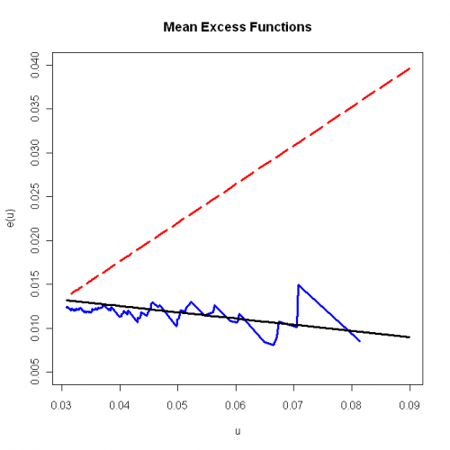
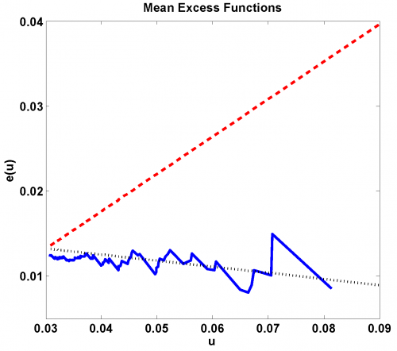

[](http://quantlet.de/)

## [](http://quantlet.de/) **SFSmeanExcessFun** [](http://quantlet.de/)

```yaml

Name of QuantLet: SFSmeanExcessFun

Published in: 'Statistics of Financial Markets : Exercises and Solutions'

Description: 'Plots the empirical mean excess function, the mean excess function of generalized Pareto distribution, the mean excess function of Pareto distribution with parameter estimated with Hill estimator for the negative log-returns of portfolio (Bayer, BMW, Siemens), time period: from 1992-01-01 to 2006-09-21. Refers to exercise 16.8 in SFS.'

Keywords: MEF, hill-estimator, pareto, returns, log-returns, distribution

See also: 'SFSevt2, SFSheavytail, SFSmsr1, SFSportfolio, SFStailGPareto, SFStailport, SFSvar_block_max_backtesting, SFSvar_block_max_params, SFSvar_pot_backtesting, SFSvar_pot_params, SFEdenport'

Author: Lasse Groth

Submitted: Mon, December 12 2016 by Monique Reiske

Datafile: 'Bay9906_close_2kPoints.txt, Bmw9906_close_2kPoints.txt, Sie9906_close_2kPoints.txt'

Example: 'Empirical mean excess plot (blue line), mean excess plot of generalized Pareto distribution (black line) and mean excess plot of Pareto distribution with parameter estimated with Hill estimator (red line) for portfolio (Bayer, BMW, Siemens) negative log-returns from 1992-01-01 to 2006-09-01.'

```





### R Code
```r

# ------------------------------------------------------------------------------ Book: SFS
# ------------------------------------------------------------------------------ Quantlet: SFSmeanExcessFun
# ------------------------------------------------------------------------------ Description: SFSmeanExcessFun plots the
# empirical mean excess function, the mean excess function of generalized Pareto distribution, the mean excess function of
# Pareto distribution with parameter estimated with Hill estimator for the negative log-returns of portfolio (Bayer, BMW,
# Siemens), time period: from 1992-01-01 to 2006-09-21.  Refers to exercise 16.8 in SFS.
# ------------------------------------------------------------------------------ Usage: -
# ------------------------------------------------------------------------------ Inputs: None
# ------------------------------------------------------------------------------ Output: Plot of the empirical mean excess
# function, the mean excess function of generalized Pareto distribution, the mean excess function of Pareto distribution
# with parameter estiamted with Hill estimator.
# ------------------------------------------------------------------------------ Example: -
# ------------------------------------------------------------------------------ Author: Lasse Groth 20091023
# ------------------------------------------------------------------------------


# Load libraries
install.packages(c("matlab", "QRM"))
library(matlab)
library(QRM)

# Close all plots and clear variables
graphics.off()
rm(list = ls(all = TRUE))

# Set working directory and load datasets
setwd("C:/...")

a = read.table("Bay9906_close_2kPoints.txt")
b = read.table("Bmw9906_close_2kPoints.txt")
c = read.table("Sie9906_close_2kPoints.txt")

d = a + b + c  #Create the portfolio
lg = dim(d)
x = log(d[-lg[1], ]) - log(d[-1, ])  #Negative log-returns

n = length(x)
x = sort(x, decreasing = TRUE)

m = 100
x1 = x[1:m]

# empirical mean excess function
t = x[1:(m + 1)]  #t must be >0

MEF = matrix(, , , )

for (i in 1:length(t)) {
    y = x[find(x > t[i])]
    MEF[i] = mean(y - t[i])
}

plot(t, MEF, type = "l", col = "blue", lwd = 3, ylim = c(0.005, 0.04), xlab = "u", ylab = "e(u)")
title("Mean Excess Functions")

# mean excess function of generalized Pareto distribution, theorem 18.8
k = 100
GPD = fit.GPD(x, nextremes = k, type = "ml", information = "observed")
K = GPD$par.ests[1]
sigma = GPD$par.ests[2]
gpme = (sigma + K * (t - mean(t)))/(1 - K)

lines(t, gpme, lwd = 3)

# Hill estimator, mean excess function of Pareto distribution
alphaH = (mean(log(x1)) - log(x1[k]))^(-1)
sigmaH = x1[k] * (k/n)^(1/alphaH)
gp1me = t/(alphaH - 1)

lines(t, gp1me, col = "red", lwd = 3, lty = 5) 

```

automatically created on 2018-05-28

### MATLAB Code
```matlab

% ---------------------------------------------------------------------
% Book:         
% ---------------------------------------------------------------------
% Quantlet:     SFSmeanExcessFun
% ---------------------------------------------------------------------
% Description:  SFSmeanExcessFun plots the empirical mean excess 
%               function, the mean excess function of generalized 
%               Pareto distribution, the mean excess function of Pareto 
%               distribution with parameter estiamted with Hill 
%               estimator for the negative log-returns of portfolio 
%               (Bayer, BMW, Siemens), time period: from 1992-01-01 to 
%               2006-09-21.
% ---------------------------------------------------------------------
% Usage:        SFSmeanExcessFun
% ---------------------------------------------------------------------
% Inputs:       None
% ---------------------------------------------------------------------
% Output:       Plot of the empirical mean excess function, the mean 
%               excess function of generalized Pareto distribution, the 
%               mean excess function of Pareto distribution with 
%               parameter estiamted with Hill estimator.
% ---------------------------------------------------------------------
% Example:     
% ---------------------------------------------------------------------
% Author:       Barbara Choros 20080730
% ---------------------------------------------------------------------

clc;
close all;

a  = load('Bay9906_close_2kPoints.txt','-ascii');
b  = load('Bmw9906_close_2kPoints.txt','-ascii');
c  = load('Sie9906_close_2kPoints.txt','-ascii');

d  = a+b+c;
x  = log(d(1:end-1))-log(d(2:end));%negative log-returns
n  = length(x)
x  = sort(x,'descend');%from positive losses to negative profits
k  = 100;
x1 = x(1:k,:);

%empirical mean excess function
t = x(1:k+1);%t must be >0
for i=1:length(t)
    y      = x(find( x > t(i)));
    MEF(i) = mean(y-t(i));
end

plot(t,MEF,'Linewidth',1.5)

%mean excess function of generalized Pareto distribution, theorem 18.8
theta  = x(k+1);
z      = x(1:k)-theta;
params = gpfit(z);
K      = params(1)
sigma  = params(2);
gpme   = (sigma+K*(t-mean(t)))./(1-K);

hold on
plot(t,gpme,'k','Linewidth',1.5,'Linestyle',':')

%Hill estimator, mean excess function of Pareto distribution
alphaH = (mean(log(x1))-log(x1(k)))^(-1)
sigmaH = x1(k)*(k/n)^(1/alphaH);
gp1me  = t./(alphaH-1)

plot(t,gp1me,'r','Linewidth',1.5,'Linestyle','--')
title('Mean Excess Functions')
xlabel('u')
ylabel('e(u)')
hold off


```

automatically created on 2018-05-28