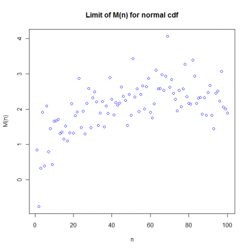
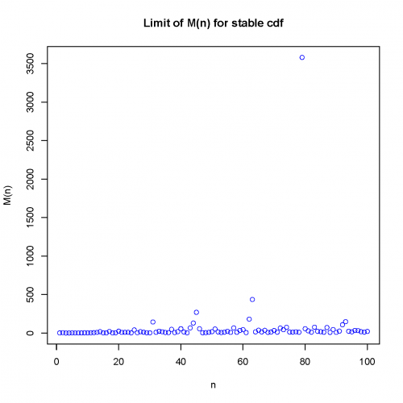
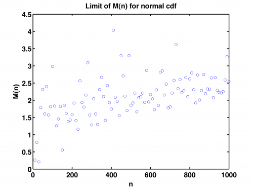
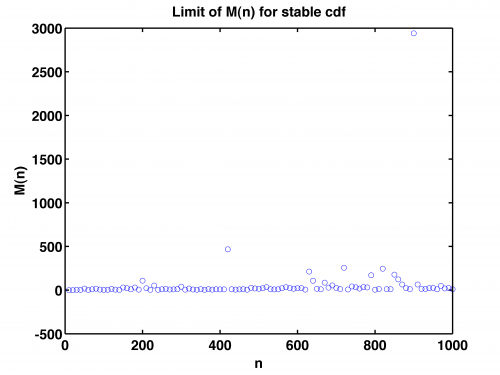

[](http://quantlet.de/)

## [](http://quantlet.de/) **SFSmsr1** [](http://quantlet.de/)

```yaml

Name of QuantLet: SFSmsr1

Published in: 'Statistics of Financial Markets : Exercises and Solutions'

Description: 'Shows the rate of convergence to infinity for the stable distributed random variables is higher than for standard normal variables. Plots the convergence rate of maximum for n random variables with a standard normal cdf and with a 1:1-stable cdf. Refers to exercise 16.2 in SFS. Requires the quantlet "stabrnd.m" for MatLab.'

Keywords: cdf, normal, random, stable, variable

See also: 'SFSevt2, SFSheavytail, SFSmeanExcessFun, SFSportfolio, SFStailGEV, SFStailGPareto, SFStailport, SFSvar_block_max_params, SFSvar_pot_params, stabrnd'

Author: Lasse Groth

Submitted: Mon, December 12 2016 by Monique Reiske

Example: The plots show the convergence rate of maxima for 1) standard normal cdf and 2) 1:1-stable cdf.


```









### R Code
```r

# ------------------------------------------------------------------------------ Book: SFS
# ------------------------------------------------------------------------------ Quantlet: SFSmsr1
# ------------------------------------------------------------------------------ Description: SFSmsr1 shows the rate of
# convergence to infinity for the stable distributed random variables is higher than for standard normal variables. Plots
# the convergence rate of maximum for n random variables with a standard normal cdf and with a 1.1-stable cdf.  Refers to
# exercise 16.2 in SFS.  ------------------------------------------------------------------------------ Usage: -
# ------------------------------------------------------------------------------ Inputs: None
# ------------------------------------------------------------------------------ Output: Plots of the convergence rate of
# maxima for standard normal cdf and 1.1-stable cdf.
# ------------------------------------------------------------------------------ Example: -
# ------------------------------------------------------------------------------ Author: Lasse Groth 20091006
# ------------------------------------------------------------------------------ install library
install.packages("QRM")

# Load library
library(QRM)

# Close all plots and clear variables
graphics.off()
rm(list = ls(all = TRUE))

n0 = 10
i = n0
n = 10000/n0
flag = 1

m = n/n0

dat1 = dat2 = matrix(, 100, 2)

for (i in 1:m) {
    
    dat1[i, 1] = i * 10
    dat1[i, 2] = max(rnorm(i, mean = 0, sd = 1))  #for normal distributions
    
    dat2[i, 1] = i * 10
    dat2[i, 2] = max(rstable(i, 1.1, 0))  #for stable distributions
}

plot(dat1[, 2], xlab = ("n"), ylab = ("M(n)"), col = "blue")
title("Limit of M(n) for normal cdf")

dev.new()
plot(dat2[, 2], xlab = ("n"), ylab = ("M(n)"), col = "blue")
title("Limit of M(n) for stable cdf") 

```

automatically created on 2018-05-28

### MATLAB Code
```matlab

% ---------------------------------------------------------------------
% Book:        SFS
% ---------------------------------------------------------------------
% Quantlet:    SFSmsr1
% ---------------------------------------------------------------------
% Description: SFSmsr1 shows the rate of convergence to infinity for 
%              the stable distributed random variables is higher than
%              for standard normal variables. Plots the convergence rate of
%              maximum for n random variables with a standard normal cdf
%              and with a 1.1-stable cdf. Requires the quantlet 
%              "stabrnd.m".
% ---------------------------------------------------------------------
% Usage:       stabrnd
% ---------------------------------------------------------------------
% Inputs:      none
% ---------------------------------------------------------------------
% Output:      Plots of the convergence rate of maxima for standard normal
%              cdf and 1.1-stable cdf.
% ---------------------------------------------------------------------
% Example:     -
% ---------------------------------------------------------------------
% Author:      Lasse Groth 20090728
% ---------------------------------------------------------------------
% 

clear
clc
close all

n0      = 10;
i       = n0;
n       = 10000 / n0;
flag    = 1;

m       = n/n0;

for i=1:m 
    
    dat1(i,1) = i*10;
    dat1(i,2) = max(randn(i,1)); %for normal distributions
    
    
    dat2(i,1)  = i*10;
    dat2(i,2 ) = max(stabrnd(1.1, 0, 1, 1, i, 1) );%for stable distributions
  
end
    
    plot(dat1(:,1),dat1(:,2),'o')
    title('Limit of M(n) for normal cdf','FontSize',16,'FontWeight','Bold')
    xlabel('n','FontSize',16,'FontWeight','Bold')
    ylabel('M(n)','FontSize',16,'FontWeight','Bold')    
    set(gca,'LineWidth',1.6,'FontSize',16,'FontWeight','Bold');
    box on
        % to save the plot in pdf or png please uncomment next 2 lines:
% print -painters -dpdf -r600 SFSmsr1_1.pdf
% print -painters -dpng -r600 SFSmsr1_1.png
    
    figure
    plot(dat2(:,1),dat2(:,2),'o')
    title('Limit of M(n) for stable cdf','FontSize',16,'FontWeight','Bold')
    xlabel('n','FontSize',16,'FontWeight','Bold')
    ylabel('M(n)','FontSize',16,'FontWeight','Bold')
    set(gca,'LineWidth',1.6,'FontSize',16,'FontWeight','Bold');
    box on
        % to save the plot in pdf or png please uncomment next 2 lines:
% print -painters -dpdf -r600 SFSmsr1_2.pdf
% print -painters -dpng -r600 SFSmsr1_2.png
```

automatically created on 2018-05-28