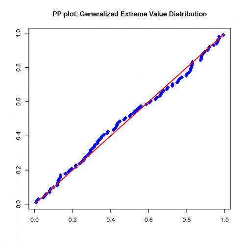
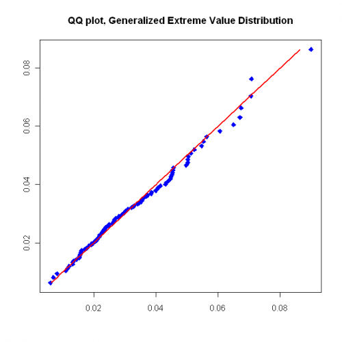
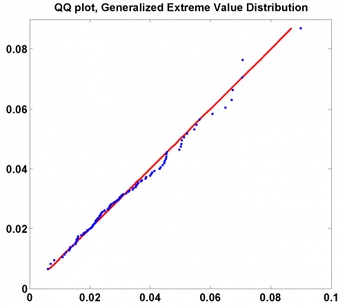
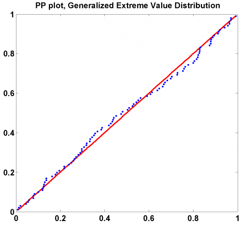

[](http://quantlet.de/)

## [](http://quantlet.de/) **SFStailGEV** [](http://quantlet.de/)

```yaml

Name of QuantLet: SFStailGEV

Published in: 'Statistics of Financial Markets : Exercises and Solutions'

Description: 'Fits a Generalized Extreme Value Distribution to the negative log-returns of a portfolio (Bayer, BMW, Siemens) for the time period from 1992-01-01 to 2006-09-21 and produces a QQ-plot and a PP-plot. Corresponds to exercise 16.5 in SFS.'

Keywords: GEV, pp-plot, qq-plot, returns, portfolio

See also: 'SFSmsr1, SFS_mef_frechet, SFEtailGEV_pp, SFSevt2, SFSheavytail, SFSportfolio, SFStailGPareto, SFStailport, SFSvar_block_max_params, SFSvar_pot_params, SFSvarblockmaxbacktesting, SFSvarpotbacktesting, SFSvar_block_max_backtesting, SFSvar_pot_backtesting'

Author: Lasse Groth

Submitted: Mon, December 12 2016 by Monique Reiske

Datafile: 'Bay9906_close_2kPoints.txt, Bmw9906_close_2kPoints.txt, Sie9906_close_2kPoints.txt'

Example: 'SFStailGEV produces a PP-plot and a QQ-plot of 100 tail values of daily log-returns of portfolio with a global parameter = 0.0498 estimated with block maxima method.'


```









### R Code
```r

# ------------------------------------------------------------------------------ Book: SFS
# ------------------------------------------------------------------------------ Quantlet: SFStailGEV
# ------------------------------------------------------------------------------ Description: SFStailGEV fits a Generalized
# Extreme Value Distribution to the negative log-returns of a portfolio (Bayer, BMW, Siemens) for the time period from
# 1992-01-01 to 2006-09-21 and produces a QQ-plot and a PP-plot.  Corresponds to exercise 16.5 in SFS.
# ------------------------------------------------------------------------------ Usage: -
# ------------------------------------------------------------------------------ Inputs: None
# ------------------------------------------------------------------------------ Output: QQ-plot and PP-plot with
# Generalized Extreme Value Distribution.  ------------------------------------------------------------------------------
# Example: - ------------------------------------------------------------------------------ Author: Lasse Groth 20091013
# ------------------------------------------------------------------------------

# Load library
install.packages("QRM")
library(QRM)

# Close all plots and clear variables
graphics.off()
rm(list = ls(all = TRUE))

# Set working directory and load datasets
setwd("C:/...")

a = read.table("Bay9906_close_2kPoints.txt")
b = read.table("Bmw9906_close_2kPoints.txt")
c = read.table("Sie9906_close_2kPoints.txt")

d = a + b + c  #Create the portfolio
lg = dim(d)
x = log(d[-lg[1], ]) - log(d[-1, ])  #Negative log-return

# Determine the Block Maxima data
T = length(x)
n = 20
k = T/n
z = matrix(, , , )

for (j in 1:k) {
    
    r = x[((j - 1) * n + 1):(j * n)]
    z[j] = max(r)
}

w = sort(z)

GEV = fit.GEV(z)  #Fit the Generalized Extreme Value Distribution

K = GEV$par.ests[1]  #shape parameter
mu = GEV$par.ests[2]  #location parameter
sigma = GEV$par.ests[3]  #scale parameter

t = (1:k)/(k + 1)

y1 = qGEV(t, K, mu, sigma)
y2 = pGEV(w, K, mu, sigma)

# Plot the QQ plot
dev.new()
plot(w, y1, col = "blue", pch = 23, bg = "blue", xlab = c(""), ylab = c(""))
lines(y1, y1, type = "l", col = "red", lwd = 2)
title("QQ plot, Generalized Extreme Value Distribution")

# Plot the PP plot
dev.new()
plot(y2, t, col = "blue", pch = 23, bg = "blue", xlab = c(""), ylab = c(""))
lines(y2, y2, type = "l", col = "red", lwd = 2)
title("PP plot, Generalized Pareto Distribution") 

```

automatically created on 2018-05-28

### MATLAB Code
```matlab

% ---------------------------------------------------------------------
% Book:         SFS
% ---------------------------------------------------------------------
% Quantlet:     SFStailGEV
% ---------------------------------------------------------------------
% Description:  SFStailGEV fits Generalized Extreme Value Distribution 
%               to the negative log-returns of portfolio (Bayer, BMW, 
%               Siemens), time period: from 1992-01-01 to 2006-09-21, 
%               and produces QQ-plot and PP-plot.
% ---------------------------------------------------------------------
% Usage:       SFStailGEV 
% ---------------------------------------------------------------------
% Inputs:       None
% ---------------------------------------------------------------------
% Output:       QQ, PP plot with Generalized Extreme Value Distribution.
% ---------------------------------------------------------------------
% Example:      -
% ---------------------------------------------------------------------
% Author:       Barbara Choros 20080709
% ---------------------------------------------------------------------

function SFStailGEV
clc;
close all;
clear all;
a = load('Bay9906_close_2kPoints.txt','-ascii');
b = load('Bmw9906_close_2kPoints.txt','-ascii');
c = load('Sie9906_close_2kPoints.txt','-ascii');
d = a+b+c;
x = log(d(1:end-1))-log(d(2:end));%negative log-returns
T = length(x);
n = 20;
k = T/n;
for j=1:k
    r    = x((j-1)*n+1:j*n);
    z(j) = max(r);
end;
parmhat = gevfit(z);
w       = sort(z);

K     = parmhat(1);%shape parameter
sigma = parmhat(2);%scale parameter
mu    = parmhat(3);%location parameter

t = (1:k)/(k+1);
y = gevinv(t,K,sigma,mu);

hold on
plot(y,y,'r','LineWidth',2)
scatter(w,y,'.')
title('QQ plot, Generalized Extreme Value Distribution')
hold off
%---------------------------------------------------------------------
figure
y = gevcdf(w,K,sigma,mu);
hold on
plot(y,y,'r','LineWidth',2)
scatter(y,t,'.')
title('PP plot, Generalized Extreme Value Distribution')
hold off
```

automatically created on 2018-05-28