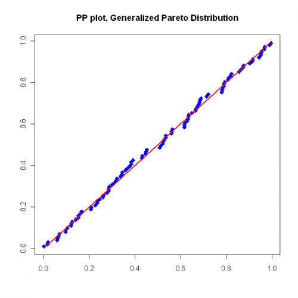
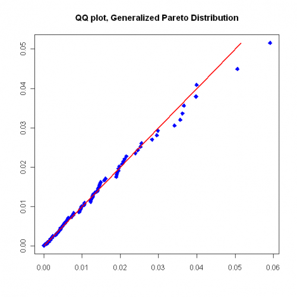
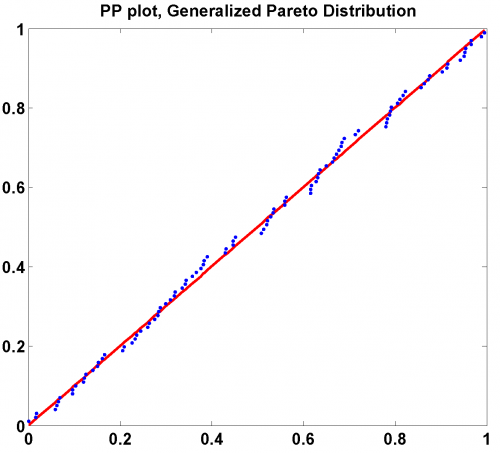
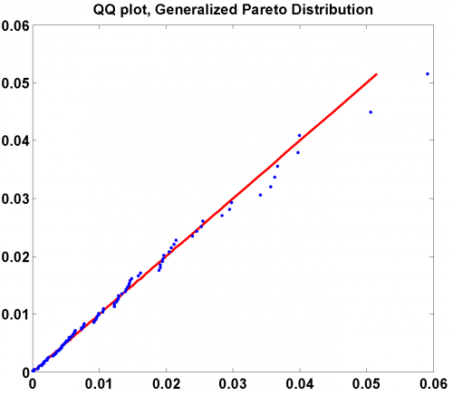

[](http://quantlet.de/)

## [](http://quantlet.de/) **SFStailGPareto** [](http://quantlet.de/)

```yaml

Name of QuantLet: SFStailGPareto

Published in: 'Statistics of Financial Markets : Exercises and Solutions'

Description: 'Estimates the parameters of a Generalized Pareto Distribution for the negative log-returns of a portfolio (Bayer, BMW, Siemens) for the time period from 1992-01-01 to 2006-09-21 and produces a QQ-plot and PP-plot. Corresponds to exercise 16.5 in SFS.'

Keywords: GEV, distribution, pareto, returns, portfolio

See also: 'SFSmsr1, SFSheavytail, SFS_mef_frechet, SFEgpdist, SFEtailGEV_pp, SFSevt2, SFSmeanExcessFun, SFSportfolio, SFStailGEV, SFStailport, SFSvar_block_max_backtesting, SFSvar_block_max_params, SFSvar_pot_backtesting, SFSvar_pot_params, SFSvarblockmaxbacktesting, SFSvarpotbacktesting'

Author: Lasse Groth

Submitted: Mon, December 12 2016 by Monique Reiske

Datafile: 'Bay9906_close_2kPoints.txt, Bmw9906_close_2kPoints.txt, Sie9906_close_2kPoints.txt'

Output: 'Produces a PP-plot and a QQ-plot of 100 tail values of daily log-returns of portfolio with a global parameter = 0.0768 estimated with POT method.'


```









### R Code
```r

# ------------------------------------------------------------------------------ Book: SFS
# ------------------------------------------------------------------------------ Quantlet: SFStailGPareto
# ------------------------------------------------------------------------------ Description: SFStailGPareto estimates the
# parameters of a Generalized Pareto Distribution for the negative log-returns of a portfolio (Bayer, BMW, Siemens) for the
# time period from 1992-01-01 to 2006-09-21 and produces a QQ-plot and PP-plot.  Corresponds to exercise 16.5 in SFS.
# ------------------------------------------------------------------------------ Usage: -
# ------------------------------------------------------------------------------ Inputs: None
# ------------------------------------------------------------------------------ Output: QQ-plot and PP-plot with
# Generalized Pareto Distribution.  ------------------------------------------------------------------------------ Example:
# - ------------------------------------------------------------------------------ Author: Lasse Groth 20091012
# ------------------------------------------------------------------------------

# Load library
install.packages("QRM")
library(QRM)

# Close all plots and clear variables
graphics.off()
rm(list = ls(all = TRUE))

# Set working directory and load datasets
setwd("C:/...")

a = read.table("Bay9906_close_2kPoints.txt")
b = read.table("Bmw9906_close_2kPoints.txt")
c = read.table("Sie9906_close_2kPoints.txt")

d = a + b + c  #Create the portfolio
lg = dim(d)
x = log(d[-lg[1], ]) - log(d[-1, ])  #Negative log-returns

n = 100  #Number of extreme observations
GPD = fit.GPD(x, nextremes = n, type = "ml", information = "observed")  #Fit the Generalized Pareto Distribution

t = (1:n)/(n + 1)
y1 = qGPD(t, GPD$par.ests[1], GPD$par.ests[2])  #Calculate quantiles for the Generalized Pareto Distribution
GPD.POT = sort(GPD$data) - GPD$threshold  #Peak Over Treshol values
y2 = pGPD(GPD.POT, GPD$par.ests[1], GPD$par.ests[2])  #Calcualte probabilities for the generalized Pareto distribution


# Plot the QQ plot
dev.new()
plot(GPD.POT, y1, col = "blue", pch = 23, bg = "blue", xlab = c(""), ylab = c(""))
lines(y1, y1, type = "l", col = "red", lwd = 2)
title("QQ plot, Generalized Pareto Distribution")

# Plot the PP plot
dev.new()
plot(y2, t, col = "blue", pch = 23, bg = "blue", xlab = c(""), ylab = c(""))
lines(y2, y2, type = "l", col = "red", lwd = 2)
title("PP plot, Generalized Pareto Distribution") 

```

automatically created on 2018-05-28

### MATLAB Code
```matlab

% ---------------------------------------------------------------------
% Book:         SFS
% ---------------------------------------------------------------------
% Quantlet:     SFStailGPareto
% ---------------------------------------------------------------------
% Description:  SFStailGPareto estimates the parameters of Generalized 
%               Pareto Distribution for the negative log-returns of 
%               portfolio (Bayer, BMW, Siemens), time period: from 
%               1992-01-01 to 2006-09-21, and produces QQ-plot and 
%               PP-plot.
% ---------------------------------------------------------------------
% Usage:        -
% ---------------------------------------------------------------------
% Inputs:       None
% ---------------------------------------------------------------------
% Output:       QQ-plot and PP-plot with Generalized Pareto 
%               Distribution.
% ---------------------------------------------------------------------
% Example:      -
% ---------------------------------------------------------------------
% Author:       Barbara Choros 20080709
% ---------------------------------------------------------------------

clc;
close all;
clear all;

a = load('Bay9906_close_2kPoints.txt','-ascii');
b = load('Bmw9906_close_2kPoints.txt','-ascii');
c = load('Sie9906_close_2kPoints.txt','-ascii');
d = a+b+c;

x = log(d(1:end-1))-log(d(2:end));%negative log-returns

n      = 100;
zb     = sort(x);
theta  = zb(end-n);
z      = zb(end-n+1:end)-theta;
params = gpfit(z);

K     = params(1);
sigma = params(2);

t = (1:n)/(n+1);
y = gpinv(t,K,sigma);

hold on
plot(y,y,'r','LineWidth',2)
scatter(z,y,'.')
title('QQ plot, Generalized Pareto Distribution')
hold off
%---------------------------------------------------------------------
figure
y = gpcdf(z,K,sigma);
hold on
plot(y,y,'r','LineWidth',2)
scatter(y,t,'.')
title('PP plot, Generalized Pareto Distribution')
hold off

```

automatically created on 2018-05-28