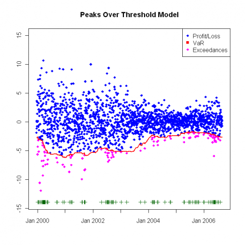
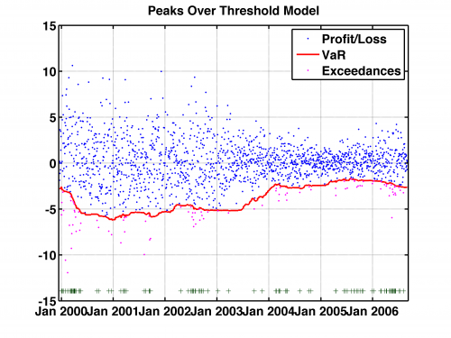

[](http://quantlet.de/)

## [](http://quantlet.de/) **SFSvar_pot_backtesting** [](http://quantlet.de/)

```yaml

Name of QuantLet: SFSvar_pot_backtesting

Published in: 'Statistics of Financial Markets : Exercises and Solutions'

Description: 'Provides backtesting results for Value at Risk computed with Peaks Over Treshold model with generalized Pareto distribution. Corresponds to exercise 16.9 in SFS.'

Keywords: POT, VaR, pareto, portfolio, historical moving window, backtest, backtesting

See also: 'SFEdenport, SFSevt2, SFSheavytail, SFSmeanExcessFun, SFSportfolio, SFStailGEV, SFStailGPareto, SFStailport, SFSvar_block_max_backtesting, SFSvar_block_max_params, SFSvar_pot_params, SFSvarblockmaxbacktesting'

Author: Lasse Groth

Submitted: Sat, October 01 2011 by Awdesch Melzer

Datafile: Bay9906_close_2kPoints.txt, Bmw9906_close_2kPoints.txt, Sie9906_close_2kPoints.txt, VaR9906_pot_Portf.txt

Example: 'var_pot_backtesting(x,y,z,v,h) where x,y,z are vectors of return; h is the size of the window and v is values of Value at Riskp produces p the number of exceedances for Value at Risk and a
	 Value-at-Risk estimation at 0.05 level for portfolio: Bayer, BMW, Siemens with size of moving window 250. Backtesting result alpha = 0.0571.'


```





### R Code
```r

# --------------------------------------------------------------------- Book: SFS
# --------------------------------------------------------------------- Quantlet: SFSvar_pot_backtesting
# --------------------------------------------------------------------- Description: SFSvar_pot_backtesting provides
# backtesting results for Value at Risk computed with Peaks Over Treshold model with generalized Pareto distribution.
# Corresponds to exercise 16.9 in SFS.  --------------------------------------------------------------------- Usage: -
# --------------------------------------------------------------------- Inputs: x,y,z - vector of returns v - values of
# Value at Risk h - size of the window --------------------------------------------------------------------- Output: p -
# Exceedances ratio Plot for the Value-at-Risk estimation at 0.05 level a portfolio of Bayer, BMW and Siemens stock for the
# time period from 1992-01-01 to 2006-09-01.  --------------------------------------------------------------------- Example:
# - --------------------------------------------------------------------- Reference: McNeil, A. (1999) Extreme Value Theory
# for Risk Managers --------------------------------------------------------------------- Author: Lasse Groth 20091102
# ---------------------------------------------------------------------

# Load libraries
install.packages("matlab")
library(matlab)

# Close all plots and clear variables
graphics.off()
rm(list = ls(all = TRUE))

# Set working directory and load datasets
setwd("C:/...")

v = read.table("VaR9906_pot_Portf.txt")
x = read.table("Bay9906_close_2kPoints.txt")
y = read.table("Bmw9906_close_2kPoints.txt")
z = read.table("Sie9906_close_2kPoints.txt")

# Size of window
h = 250

v = -v
V = x + y + z
d = dim(V)

L = V[-1, ] - V[1:(d[1] - 1), ]
T = length(L)


outlier = matrix(, 1, T - h)
exceedVaR = matrix(, , )

exceedVaR = (L[(1 + h):(d[1] - 1)] < v[1:(T - h)])  #Check for exceedances
for (j in 1:(T - h)) {
    if (exceedVaR[j] == TRUE) 
        {
            outlier[j] = L[j + h]
        }  #Find exceedances
}

K = find(is.finite(outlier))
outlier = outlier[K]

p = round(sum(exceedVaR[1, ])/(T - h), 4)  #Calculate the exceedance ratio

v = t(v)

# Plot the values, VaR estimation and the exceedances
plot(L[(h + 1):(d[1] - 1)], pch = 18, col = "blue", xlim = c(-3, 1755), ylim = c(-14, 15), xlab = c(""), ylab = c(""), axes = FALSE)
box()
axis(1, c(261, 521, 782, 1043, 1304, 1566, 1826) - 250, c("Jan 2000", "Jan 2001", "Jan 2002", "Jan 2003", "Jan 2004", "Jan 2005", 
    "Jan 2006"))
axis(2)
title("Peaks Over Threshold Model")

points(K, outlier, pch = 18, col = "magenta")
lines(v, col = "red", lwd = 2)

yplus = K * 0 + min(L[(h + 1):(d[1] - 1)]) - 2
points(K, yplus, pch = 3, col = "dark green")

legend("topright", c("Profit/Loss", "VaR", "Exceedances"), pch = c(18, 15, 18), col = c("blue", "red", "magenta"))

# Print the exceedances ratio
print(paste("Exceedances ratio:", "", p)) 

```

automatically created on 2018-05-28

### MATLAB Code
```matlab

% ---------------------------------------------------------------------
% Book:         SFS
% ---------------------------------------------------------------------
% Quantlet:     SFSvar_pot_backtesting
% ---------------------------------------------------------------------
% Description:  SFSvar_pot_backtesting provides backtesting results for
%               Value at Risk computed with Peaks Over Treshold model 
%               with generalized Pareto distribution.
% ---------------------------------------------------------------------
% Usage:        var_pot_backtesting(x,y,z,v,h)
% ---------------------------------------------------------------------
% Inputs:       x,y,z - vector of returns
%               v - values of Value at Risk
%               h - size of the window
% ---------------------------------------------------------------------
% Output:       p - number of exceedances for Value at Risk
% ---------------------------------------------------------------------
% Result:       Number of exceedances for Value at Risk computed with
%               Peaks Over Treshold model with generalized Pareto
%               distribution.
% ---------------------------------------------------------------------
% Example:      -
% ---------------------------------------------------------------------
% Reference:    McNeil, A. (1999) Extreme Value Theory for Risk Managers
% ---------------------------------------------------------------------
% Author:       Barbara Choros, 14.10.2007
% ---------------------------------------------------------------------


clear;
clc;
close all

x = load('Bay9906_close_2kPoints.txt','-ascii');
y = load('Bmw9906_close_2kPoints.txt','-ascii');
z = load('Sie9906_close_2kPoints.txt','-ascii');

h = 250;
v = load('VaR9906_pot_Portf.txt','-ascii');
p = var_pot_backtesting(x,y,z,v,h)
title('Peaks Over Threshold Model','FontSize',16,'FontWeight','Bold')


    % to save the plot in pdf or png please uncomment next 2 lines:
 % print -painters -dpdf -r600 SFSvar_pot_backtesting.pdf
 % print -painters -dpng -r600 SFSvar_pot_backtesting.png

```

automatically created on 2018-05-28