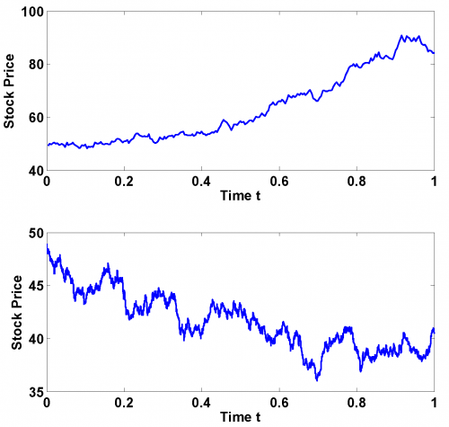
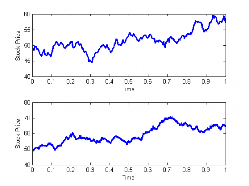

[](http://quantlet.de/)

## [](http://quantlet.de/) **SFSrwdiscretetime** [](http://quantlet.de/)

```yaml

Name of QuantLet: SFSrwdiscretetime

Published in: 'Statistics of Financial Markets : Exercises and Solutions'

Description: 'Simulates a random stock price movement in discrete time with delta t = 1 day (upper panel) and 1 hour (lower panel) respectively for a period of one year.'

Keywords: brownian-motion, discrete, random, simulation, stock-price

See also: SFSbb

Author: Weining Wang, Dedy Dwi Prastyo

Submitted: Tue, December 22 2009 by Lasse Groth

Example: 'These plots show random stock price movements with different delta t. 
	 miu: expected return p.a. = 0.11
	 sigma: volatility p.a.    = 0.2
	 m: starting value         = 49'


```





### MATLAB Code
```matlab

% ---------------------------------------------------------------------
% Book:         SFS
% ---------------------------------------------------------------------
% Quantlet:     SFSrwdiscretetime
% ---------------------------------------------------------------------
% Description:  Simulation of a random stock price movement in discrete 
%               time with delta t = 1 day (upper panel) and 1 hour (lower
%               panel) respectively for a period of one year.
% ---------------------------------------------------------------------
% Usage:        -
% ---------------------------------------------------------------------
% Inputs:       miu   - expected return p.a.
%               sigma - volatility p.a.
%               m     - starting value
% ---------------------------------------------------------------------
% Output:      Plot of random stock price movements with different delta
%              t.
% ---------------------------------------------------------------------
% Example:     miu = 0.11;
%              sigma = 0.2;
%              m = 49;
% ---------------------------------------------------------------------
% Author:      Weining Wang 20090914
% ---------------------------------------------------------------------
% 

clear
clc
close all

%Parameter input
disp('Please input miu, sigma, m  as: [0.11,0.2,49] ') ;
disp(' ') ;
para = input('[miu, sigma, m]=');

while length(para) < 3
  disp('Not enough input arguments. Please input in 1*4 vector form like [50,0.13,0.2,49]');
  para = input('[miu, sigma, m]=');
end

while para(2) < 0
  disp('Please define positive volatility');
  para = input('[miu, sigma, m]=');
end

miu   = para(1);
sigma = para(2);
m     = para(3);
disp(' ') ;

N1 = 250;  %250 days in one year
N2 = 2000; %8 trading hours per day

% Simulates a random stock price movement in discrete time
i      = 0;
delta1 = 1/250;
delta2 = 1/2000;
s1     = m; 		% Start value
s2     = m;
while (i < N1)
    i    = i+1;
    seed = normrnd(0,1);
    d1   = s1(length(s1))*exp((miu - (1/2)*(sigma^2))*delta1 + sigma*sqrt(delta1)*seed);
    s1   = [s1;d1];
end

i = 0;
while (i<N2)
    i    = i+1;
    seed = normrnd(0,1);
    d2   = s2(length(s2))*exp((miu - (1/2)*(sigma^2))*delta2 + sigma*sqrt(delta2)*seed);
    s2   = [s2;d2];
end

s1 = s1(2:length(s1));
s2 = s2(2:length(s2));

subplot(2,1,1)
a1    = 1:length(s1);
path1 = [a1',s1];
plot(path1(:,1)/250,path1(:,2))
xlabel('Time t')
ylabel('Stock Price')

subplot(2,1,2)
a2    = 1:length(s2);
path2 = [a2',s2];
plot(path2(:,1)/2000,path2(:,2))
xlabel('Time t')
ylabel('Stock Price')
```

automatically created on 2018-05-28