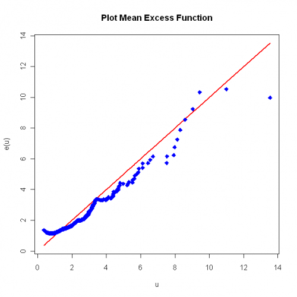
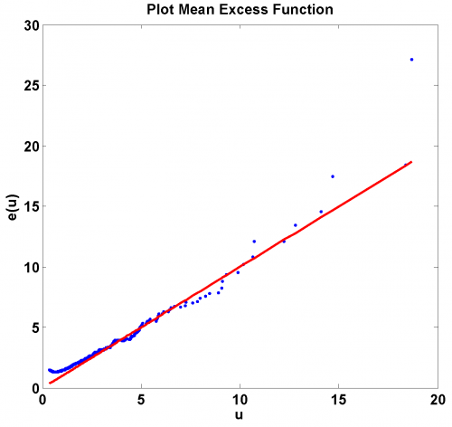

[](http://quantlet.de/)

## [](http://quantlet.de/) **SFS_mef_frechet** [](http://quantlet.de/)

```yaml

Name of QuantLet: SFS_mef_frechet

Published in: 'Statistics of Financial Markets : Exercises and Solutions'

Description: 'Plots the theoretical and empirical mean excess function e(u) of the Frechet distribution with alpha = 2.'

Keywords: Frechet, MEF, distribution, empirical, plot

See also: 'SFSevt2, SFSportfolio, SFStailGEV, SFStailGPareto, SFStailport, SFSvar_block_max_params, SFSvar_pot_params'

Author: Lasse Groth

Submitted: Mon, December 12 2016 by Monique Reiske

Author[MatLab]: Barbara Choros-Tomczyk

Example: 'This plot shows the theoretical (red line) and empirical (blue line) mean excess function for the Frechet distriubtion with alpha = 2.'


```





### R Code
```r

# ------------------------------------------------------------------------------ Book: SFS
# ------------------------------------------------------------------------------ Quantlet: SFS_mef_frechet
# ------------------------------------------------------------------------------ Description: SFS_mef_frechet plots the
# theoretical (red line) and empirical (blue) Mean excess function e(u) of the Frechet distribution with alpha = 2
# ------------------------------------------------------------------------------ Usage: -
# ------------------------------------------------------------------------------ Inputs: none
# ------------------------------------------------------------------------------ Output: Plot of mean excess function for
# Frechet distriubtion.  ------------------------------------------------------------------------------ Example: -
# ------------------------------------------------------------------------------ Author: Lasse Groth
# ------------------------------------------------------------------------------

# Close all plots and clear variables
graphics.off()
rm(list = ls(all = TRUE))

# Install and load library
install.packages("matlab")
library(matlab)

# Simulate Frechet Distribution
nsim = 1000
urv = runif(nsim, min = 0, max = 1)
ones = matrix(1, nsim, 1)
rv = ones/((-log(urv))^(1/(2 * ones)))

k = 999

rv = sort(rv, decreasing = TRUE)
MEF = matrix(, , , )
t = rv[1:k + 1]  #t must be >0

# Calculate the empirical mean excess function
for (i in 1:length(t)) {
    y = rv[rv > t[i]]
    MEF[i] = mean(y - t[i])
}

plot(t[3:k + 1], t[3:k + 1], type = "l", col = "red", lwd = 2, xlab = c("u"), ylab = c("e(u)"))
points(t[3:k + 1], MEF[3:k + 1], col = "blue", pch = 23, bg = "blue")
title("Plot Mean Excess Function") 

```

automatically created on 2018-05-28

### MATLAB Code
```matlab

% ---------------------------------------------------------------------
% Book:        SFS
% ---------------------------------------------------------------------
% Quantlet:    SFS_mef_frechet
% ---------------------------------------------------------------------
% Description: SFS_mef_frechet plots the theoretical (red line) and empirical 
%               (blue) Mean excess function e(u) of the Frech�t 
%               distribution with alpha = 2
% ---------------------------------------------------------------------
% Usage:       SFS_mef_frechet
% ---------------------------------------------------------------------
% Inputs:      none
% ---------------------------------------------------------------------
% Output:      Plot of mean excess function for Frechet distriubtion.
% ---------------------------------------------------------------------
% Example:     -
% ---------------------------------------------------------------------
% Author:      Barbara Choros 
% ---------------------------------------------------------------------
% 

% Simulate Frechet Distribution
clear
clc
close all

nsim =  1000;
    urv = rand(nsim,1);
    rv  = ones(nsim,1)./((-log(urv)).^(1./2*ones(nsim,1)));
    k   = 999;
    
% Calculate the empirical mean excess function 
    rv = sort(rv,'descend');
    t  = rv(1:k+1);%t must be >0
for i=1:length(t)
    y      = rv(find(rv > t(i)));
    MEF(i) = mean(y-t(i));
end
plot(t(3:k+1),MEF(3:k+1),'.','MarkerSize',10);
hold on;
plot(t(3:k+1),t(3:k+1),'LineWidth',2,'Color','r');
title('Plot Mean Excess Function');
xlabel('u');
ylabel('e(u)');
```

automatically created on 2018-05-28